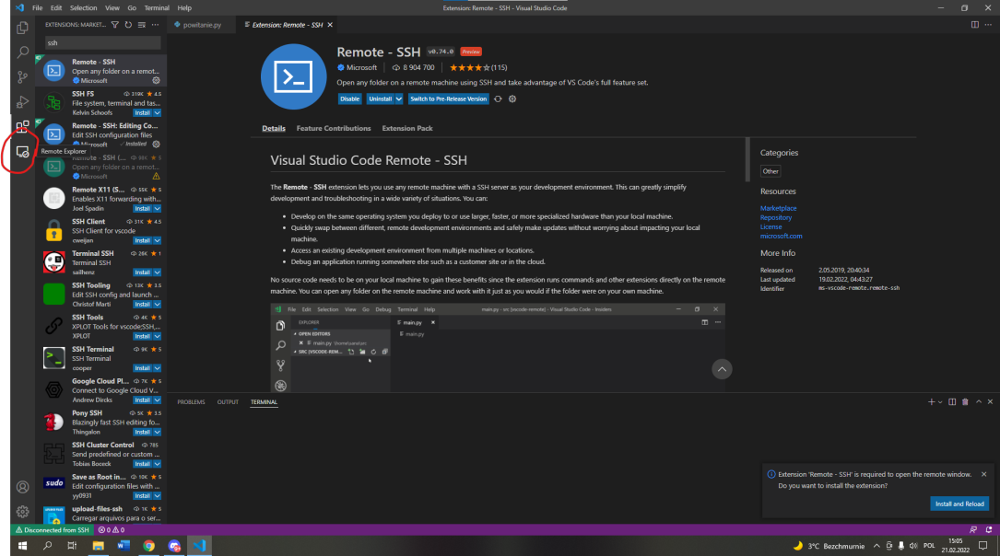
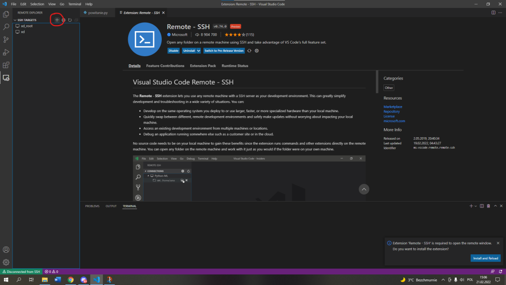
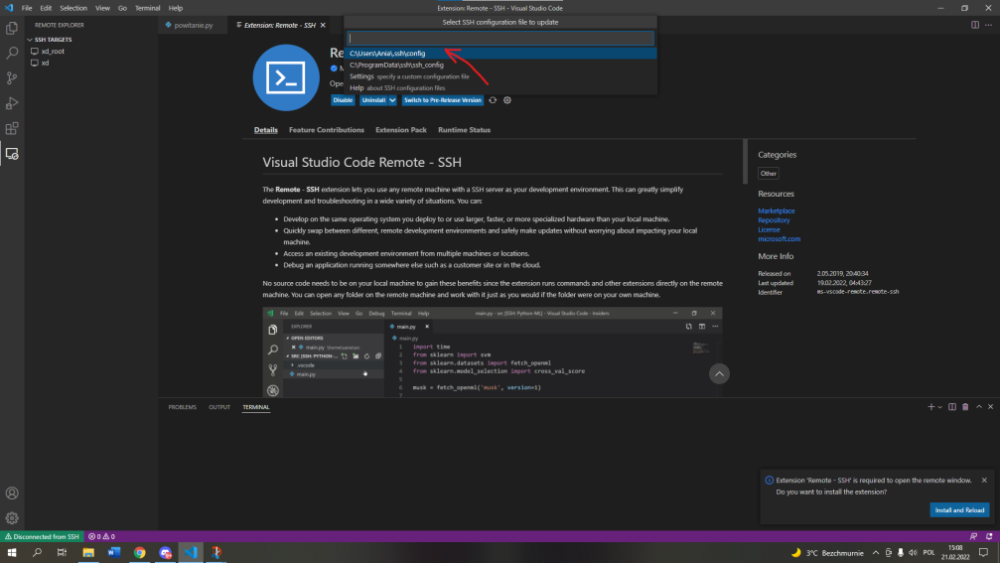
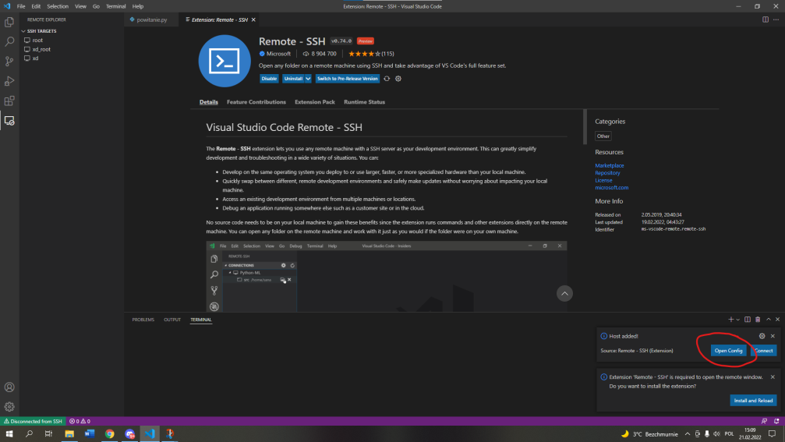
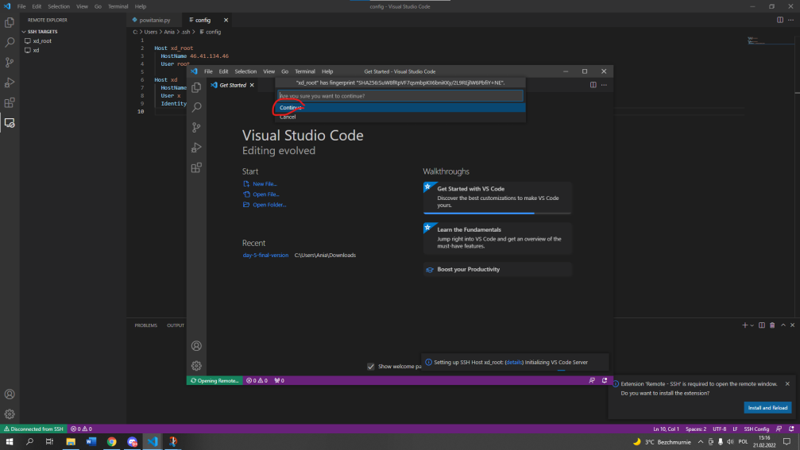
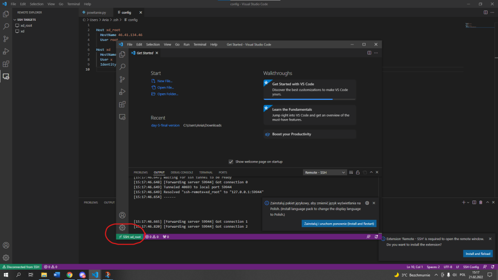
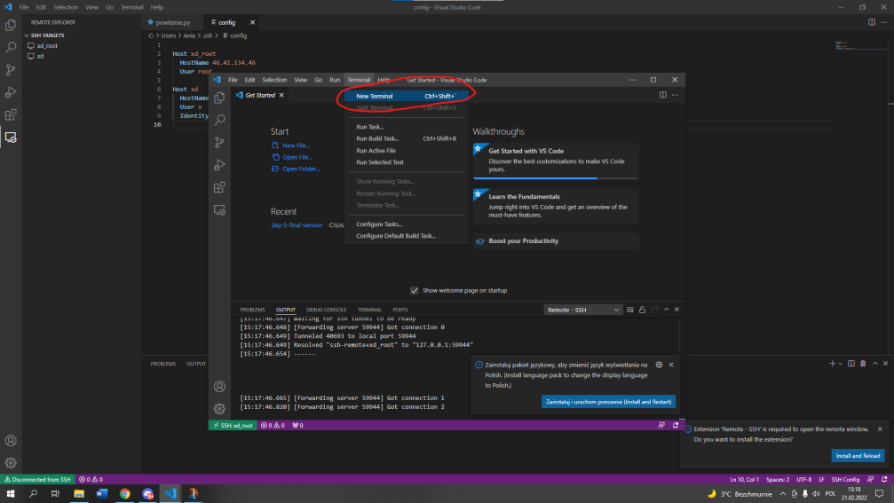

# Szturm na AWS

## Etap 4.3 - Zdobądź serwer: połączenie z serwerem przez VSCode

Masz już VSCode, masz serwer, znasz jego login, adres ip, wiesz gdzie jest folder .ssh.

[Zobacz jak połączyć się z serwerem przez VSCode](http://bityl.pl/nYH1X)


#### Cel:
Wejdź na Twój serwer przez VSCode.

#### Plan:

#### 1. Otwórz VSCode i zainstaluj rozszeżenie Remote-SSH.


Extensions (5 ikonka po lewej od góry)


3. W search wpisz: SSH i kliknij w najwyższą pozycję: Remote-SSH i kliknij w niebieski przycisk: Install. Gdy się zainstaluje kliknij w zaznaczony na czerwono przycisk z połączeniami.



4. Kliknij plusika aby utworzyć nowe połączenie.


5. Wpisz w połączenie cokolwiek i naciśnij enter.

Tu się normalnie wpisuje coś w stylu:
```
ssh root@1.2.3.4
```
lub
```
ssh -i klucz.pem ubuntu@1.2.3.4
```
Ale Ty wpisz narazie cokolwiek.

6. Spyta się Ciebie o plik config. Wybierz ten który kończy się na .ssh\config. Ten jest zawsze na samej górze listy na niebiesko. Kliknij go.


7. Na dole pojawi się okno, kliknij na zaznoczony na czerwono przycisk aby zobaczyć plik config w folderze .ssh


8. Wyświetli Ci się plik config. Jeżeli jest pusty, będzie wyglądał jak poniżej. Jeżeli jest pełny i nie wiesz czy są to prawidłowe dane, to skopiuj je, zapisz obok a z tego pliku wykasuj i zaraz uzupełnimy je od nowa.



9. Wklej do pliku config poniższe dane:


Tu będzie też kilka słów więcej o pliku config i folderze .ssh.


#### config dla Home:
```
Host xd_root
  HostName 1.1.1.1
  User root
	
Host xd
  HostName 1.1.1.1
  User xd
  IdentityFile "~/.ssh/tu_wstaw_nazwe_klucza"
```

#### config dla AWS:

```
Host xd_ubuntu
  HostName 1.1.1.1
  User ubuntu
  IdentityFile "~/.ssh/tu_wstaw_nazwe_klucza.pem"

Host xd
  HostName 1.1.1.1
  User moja_nazwa_uzytkownika
  IdentityFile "~/.ssh/tu_wstaw_nazwe_klucza"
```

Będzie to wyglądało np. w ten sposób jak w screenie z punktu 9. (tutaj opcja z serwerami w Home). 

**I zapisz plik (ctrl+s).**

9. Teraz najtrudniejsze. Po lewej stronie, pod "SSH TARGETS" pojawią się 2 pola, po jednym dla każdego "Host" które zdefiniowałeś krok wcześniej. Najedź na jeden z nich. Wtedy ok. 3cm od niego po prawej stronie pojawi się malutka ikonka. Gdzieś w okolicach miejsca zaznaczonego na czerwono w poniższym obrazku. Najedź tam i kliknij.


10. Otworzy się nowe okno z połączeniem z serwerem. 

Spyta się czy chcesz kontynuować. Daj opcję na górze, że tak.

Czasem spyta jeszcze, z jakim systemem się łączysz. Wybierz wtedy Linux (bo taki jest system Twojego serwera) - to zwykle też opcja na samej górze - i klikni w nią także - o ile się pojawiła. Obie wyglądają podobnie jak ta na screenie na dole:


11. Dalej, jeżeli wybrałeś drogę Home, spyta się Ciebie o hasło. Podaj je. Możesz je zawsze zmienić w panelu home. Jeżeli wybrałeś drogę AWS i poprawnie podałeś klucz w kroku 9, to tego kroku nie będzie ale odrazu połączysz się z serwerem.








4. Kliknij w Remote Explorer (6 ikonka po lewej od góry)

5. Jeżeli przechodzisz to pokolei, to powinien pojawić Ci się w SSH TARGETS conajmniej 1 punkt do połączenia, zdefiniowany w pliku config (lub Config). Możesz go edytować.

7. Najedź na niego myszką. Po prawej stronie pokaże Ci się przycisk którym połączysz się w nowym oknie z serwerem :)

8. W listwie na górze w nowym oknie spyta się Ciebie o haslo.
- Jeżeli to Cię nie połączy 3 razy i wybierz "more actions" 
- Wybierz Open SSH Configuration File i sprawdź czy tutaj wszystko się zgadza albo spytaj się opomoc.

9. Jesteś na serwerze. Hurra :) To jeszcze raz wyjdź wyłączając to okno.

#### 2. Połącz się z serwerem aby sprowokować otworzenie pliku config w folderze .ssh


#### 3. Otwórz z .ssh plik config i wklej tam w zalezności od tego czy masz server w Home czy w AWS:

Tu będzie też kilka słów więcej o pliku config i folderze .ssh.


#### config dla Home:
```
Host xd_root
  HostName 1.1.1.1
  User root
	
Host xd
  HostName 1.1.1.1
  User xd
  IdentityFile "~/.ssh/tu_wstaw_nazwe_klucza"
```

#### config dla AWS:

```
Host xd_ubuntu
  HostName 1.1.1.1
  User ubuntu
  IdentityFile "~/.ssh/tu_wstaw_nazwe_klucza.pem"

Host xd
  HostName 1.1.1.1
  User moja_nazwa_uzytkownika
  IdentityFile "~/.ssh/tu_wstaw_nazwe_klucza"
```

Od teraz zawsze połączysz się z serwerem w 3 kliknięciach:
- Włączając VSC
- Klikając w Remote Explorer (5 klocek po lewej)/var/www/flaga/app.py
- Kliknij w znaczek po prawej stronie Twojego serwera na liśćie połączeń
- Wpisz hasło i jesteś na swoim serwerze z poziomu VSCt

I jesteś. 

Połącz się i rozłącz kilka razy.


#### VSC: Clone

1. Kliknij w 3 klocek od góry z lewej **(Source Controll)**
2. Kliknij w duży niebieski przycisk na dole **(Clone Repository)**
3. Wklej link do repozytorium które chcesz sklonować
```
git clone https://github.com/ZPXD/zajecia_programowania_xd
```
4. Spyta się Ciebie w jakim folderze - podaj katalog domowy
5. Spyta się Cibie czy otworzyć ten folder - powiedz, że tak


##### Mobilność

1. Otwórz Pierwszy plik.
2. Otwórz Drugi plik obok, w innym folderze.
3. Stwórz Trzeci plik i zapisz.
4. Otwórz Pierwsz i Drugi plik aby były jedncześnie widoczne.
5. Flodery - otwórz katalog jako folder - aby mieć listę plików z lewej.


#### 3. Upewnij się, że jesteś jako root na serwerze. ("administratorem").

Zobacz czy jesteś na serwerze jako **root**. Poniższa komenda pokaże Ci root, ubuntu albo inną nazwę.
```
echo $USER
``` 
Jeżeli nie jesteś root, to bądź :) Jeżeli jesteś na np. ubuntu, ustaw **root**.
```
sudo passwd
su
echo $USER
```

#### 4. Update paczek.

Uaktualnij paczki :) 

```
apt update
```


#### 7. Krok dodatkowy: Spróbuj się połączyć z serwerem terminala/powershell ; )

Na windowsie 10 możesz szybko włączyć powershell, nie ważne w jakim folderze jesteś:
- **linux/mac terminal:** (linux, mac) klikając jednocześnie **ctrl+shift+t**
- **windows powershell:** (windows) otwórz folder w którym chcesz otworzyć terminal i kliknij w adres i napisz tam powershell - otworzy się. Od teraz, nie ważne czy jesteś na powershellu czy w terminalu, będę na tego typu okno mówił terminal, a powershell używał jedynie gdy będę opisywał coś co dotyczy konkretnie powershella.

Jeżeli terminal/powershell otworzy się, wpisz:
```
ssh xd_root
```
Działa? Super! :))) Możesz zacżąć bawić się swoim terminalem/powershellem.
Nie działa? Spoko, pomówimy o tym w przyszłości. Narazie to nie takie ważne, idź dalej :)

[Dodatkowe sposoby i instrukcje łączenia się z serwerem: powershell/terminal/PuTTy dla Win7/8/10/11/LinuxUbuntu/MACOS](http://bityl.pl/6X3gF)


**Serwer zdobyty!**

Teraz połącz się aby zacząć na nim tworzyć. Będziesz pisać tu programy, udostępniać je w sieci i robić wiele innych rzeczy. 


#### Wsparcie:

[Pomoc na discordzie dla problemów związanych z Etapem 4](https://discord.gg/8YQAaBHh3u)


**Przejdź dalej:** [Etap 5 - Domena - Instrukcje](http://bityl.pl/Q86MW)

