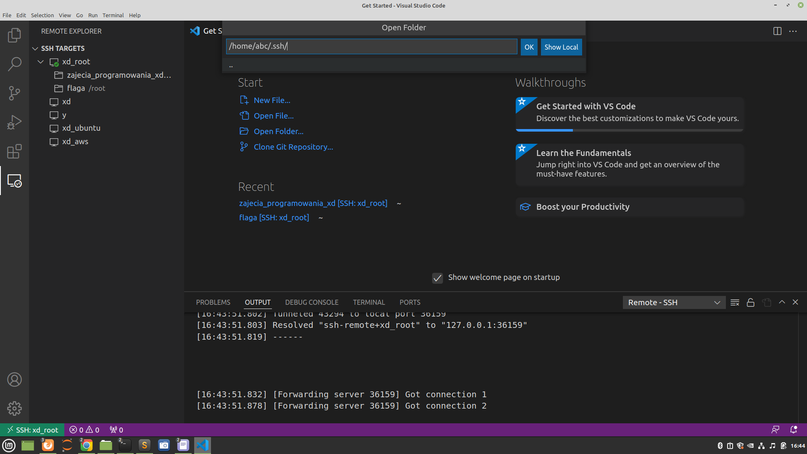
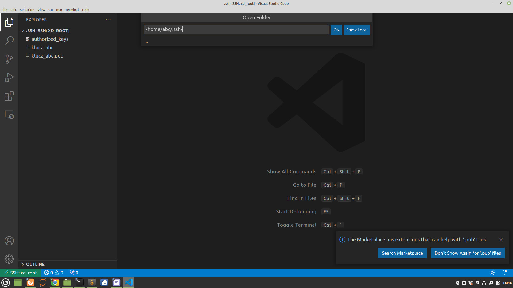
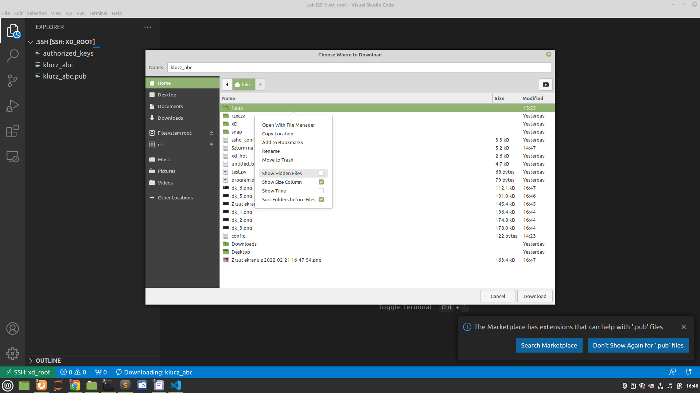
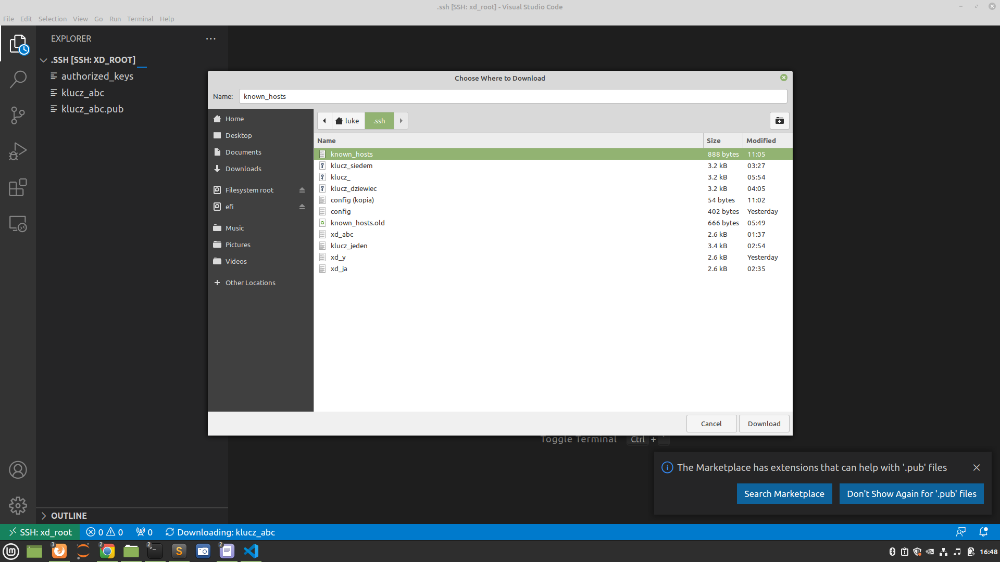
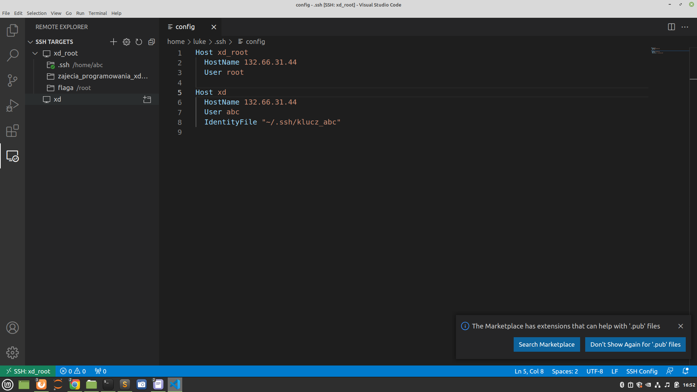
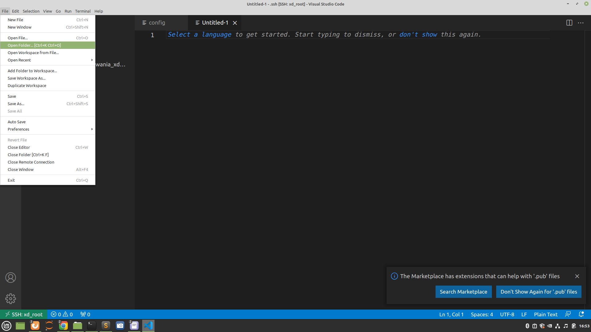
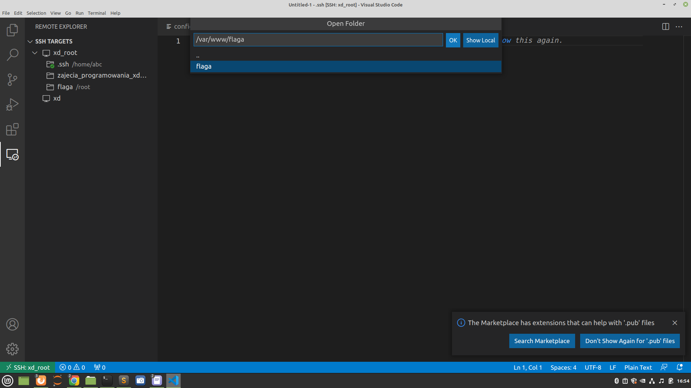

# Szturm na AWS

## Etap 7 - przygotuj serwer, postaw stronę www i powieś Flagę - wersja ASAP

**1. Przygotujesz serwer. **Zupdatujemy i poinstalujemy trochę programów, w tym:
- git'a
- nginx'a
- nano
- program do tworzenia środowisk programistycznych venv
**2. Pobierzesz kod z repozytorium flaga: https://github.com/ZPXD/flaga**
- uzupełnimy plik z danymi o nazwę przygotowanej domeny
- automatycznie "poprozkładamy" pliki konfigurujące nginx i gunicorn we właściwych miejscach
**3. Uruchomisz "usługę" aplikacji strony www ** tak aby była wystawiona w internecie i zobaczysz swoją stronę www sieci pod linkiem domeny. 

- [Obejrzyj film jaks przygotować serwer, postawić stronę i powiesić flagę w wersji ASAP (w 5 minut)]()

#### PS: Jeżeli uznasz, że potrzebujesz bardziej wyczerpujących wyjaśnień i mocniejszych doświadczeń, wybierz:

[Etap 7 - droga Klasyczna - Instrukcje]( http://bityl.pl/BcfxJ)

I postaw cały serwer ręcznie, komenda po komendzie ucząc się po drodze Linuxa, a to na Linuxowych serwerach będą śmigały nasze skrypty, więc jest to absolutny fundament.

#### Do dzieła.

#### Cel:
- Postaw stronę www: niech będzie widoczna w internecie pod adresem Twojej domeny.
- Przygotuj serwer: załóż użytkownika i stwórz klucz RSA, pobierz go i zaloguj się nim ponownie.
- Modyfikuj zakładkę /xd swojej flagi.

#### Wsparcie:

[Pomoc na discordzie dla problemów związanych z Etapem 7](https://discord.gg/S5bN7TCAYq)


# Droga ASAP (Flaga w 5 minut):
 
 
**Słowem wstępu: Gdyby coś poszło nie tak, to można zrestartować serwer do ustawień początkowych:**
[Restart](http://bityl.pl/Bmvwu). Zaczynajmy:


Po zalogowaniu na serwer:

#### 1. wejdź na root (utwórz go jeżeli jeszcze nie robiłeś).
Powinieneś być już root. Robiliśmy to w [Etap 4 w kroku 6](https://github.com/ZPXD/flaga/blob/main/instrukcje/etap_4_3_zdobadz_serwer_polaczenie.md). Sprawdź to:
```
echo $USER
```
Jak pokazuje root to idź do kroku 2. Jeżeli nie, utwórz hasło dla root wpisując:
```
sudo su
```
I sprawdź znów pisząc "echo $USER", aż będzie pokazywać root. Jak masz błąd, wróć do etapu 4.3 lub spytaj na grupie o pomoc.

#### 2. Uruchom skrypt unite_the_clans.sh i wygraj przygodę za 1 komendą:

Poniższa komenda - wklej ją całą i puść enter :) po drodze spyta Cię o użytkownika i domenę. Domenę podaj jota w jotę bez spacji, bez dodatku 'http://' i bez 'www'. Użytkownika podaj bez spacji, dużych liter, znaków specjalnych. 
```
wget -q 'https://raw.githubusercontent.com/ZPXD/flaga/main/pomocnicze_skrypty/unite_the_clans.sh' && chmod +x unite_the_clans.sh && ./unite_the_clans.sh;
```

Zobacz w przeglądarce, Twoja strona już powinna być w internecie :)


#### 3. I gotowe :) pobierz jeszcze klucz RSA, umieść go wypełniając poniższe:















Jak masz serwer w AWS - uzupełnij: 
- NAZWA_KLUCZA_PEM.pem - nazwa Twojego klucza .pem z AWS.
- NUMER_IP - numer IP Twojego serwera.
- NAZWA_KLUCZA - to "klucz_" + nazwa Twojego użytkownika. Możesz sprawdzić na serwerze pisząc
```
ls /home/$USER/.ssh/
```

Wklej sobie poniższą komendę do notatnika i uzupełnij ją poniższą komendę:
```
scp -i NAZWA_KLUCZA_PEM.pem ubuntu@NUMER_IP:/home/ubuntu/NAZWA_KLUCZA NAZWA_KLUCZA
```
Jak masz serwer VPS z Home:
```
scp root@NUMER_IP:/home/NAZWA_UZYTKOWNIKA_NA_SERWERZE/.ssh/NAZWA_KLUCZA NAZWA_KLUCZA
```
Klucz wrzuć do folderu .ssh i dodaj go do pola w pliku .ssh/config wg. wzoru:

```
Host moj_serwerek
  HostName 1.1.1.1
  User rafal_paczes
  IdentityFile /home/rafi/.ssh/potezny_klucz_rafiego
```

Gotowe! Pobaw się flagą, zmień coś (zobacz etap 8 w tym pliku) lub idź dalej. 


## Etap 8: Flaga.

- Edytuj plik tekstowy którego treść widać na Twojej stronie.
- Zobaczy czy na stronie jest nowa treść!
- Stwórz nową zakładkę wymaganą do przejścia szturmu!
- Zobacz czy zakładka działa :)


#### Edytuj plik tekstowy którego treść widać na Twojej stronie.

Urządź się tu :) Będąc dalej na serwerze, w folderze /var/www/flaga edytuj zawartość pliku xd.txt. Dodaj tam coś od siebie.
```
cd /var/www/flaga
nano dane/xd.txt
```

#### Zobaczy czy na stronie jest nowa treść!


Zobacz na stronie www czy działa :)


#### Stwórz nową zakładkę wymaganą do przejścia szturmu!

Ostatnie co zostało, to edycja zakładki /xd flagi. Twoja flaga aby przejść dalej musi spełniać 3 kryteria. 
- być widoczna w sieci, czyli działać - to mamy
- w zakładce xd jest na niej "xD" - to też już mamy
- w zakladce xd jest na niej coś napisane poza "xDDD" - to mamy do zrobienia.

Wejdź w przeglądarce na adres swojej strony www i dopisz **/xd** - to Twoja zakładka /xd.

Bedąc dalej w folderze /var/www/flaga edytuj plik templates/xd.html. Zobacz, jest tam w 12 linii "xDDD". Zostaw xD (z dowolną ilością "D") i: dodaj coś od siebie. Dzięki temu będzie można sprawdzić czy ukończyłeś ten etap. Zrób to tak:
```
nano templates/xd.html
```
To plik html. Dodaj coś w 12 linii pomiędzy znakami ">" a "</h1>".
```
<h1 style="text-align:center">xDDD TUTAJ OD SIEBIE DOPISZ :) </h1>
```
Przeładuj:
```
sudo systemctl restart flaga.service
```
lub
```
sudo python3 pomocnicze_skrypty/reload.py
```

#### Zobacz czy zakładka działa :)

Zobacz na stronie www czy działa :) - dodaj do swojego adresu "/xd" czyli jak masz domenę "kubus-puchatek.pl" to wpisz "kubus-puchatek.pl/xd".


#### Gotowe?
Możesz opuścić Terminal pisząć:

Najpierw aby się wylogować:
```
exit
```
Potem aby opuścić terminal:
```
exit
```
A strona nadal będzie stała w internecie.


 ** Powieś swoją flagę! **

**Cel:** dodaj coś do xDDD. Zmień coś. Zrób coś po swojemu.

**Instrukcje:**
 http://bityl.pl/wyF86

    - dorga dla mezczyzn 
    - droga za 3 kliknieciami: a, b, run
    - edycja flagi

1. Wejdź na swoją nową domenę.
2. Jak działa to pochwal się komuś. Wrzuć też na kanał #flaga.
3. I pobaw się flagą, modyfikuj ją. Opis jak to zrobić jest w kroku 6 w instrukcji: https://github.com/ZPXD/flaga

**Gotowe? Powiedź czy wszystko gra:**
https://zajecia-programowania-xd.pl/szturm_na_aws/8


**Przejdź dalej:** [Etap 8 - Materiały i Jupyter - Instrukcje](http://bityl.pl/7efYd)
