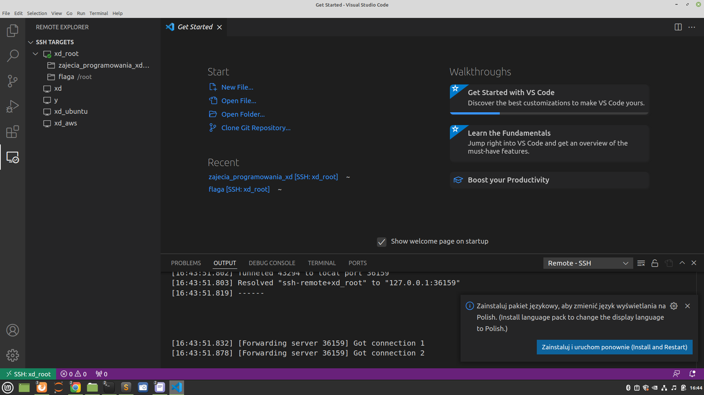
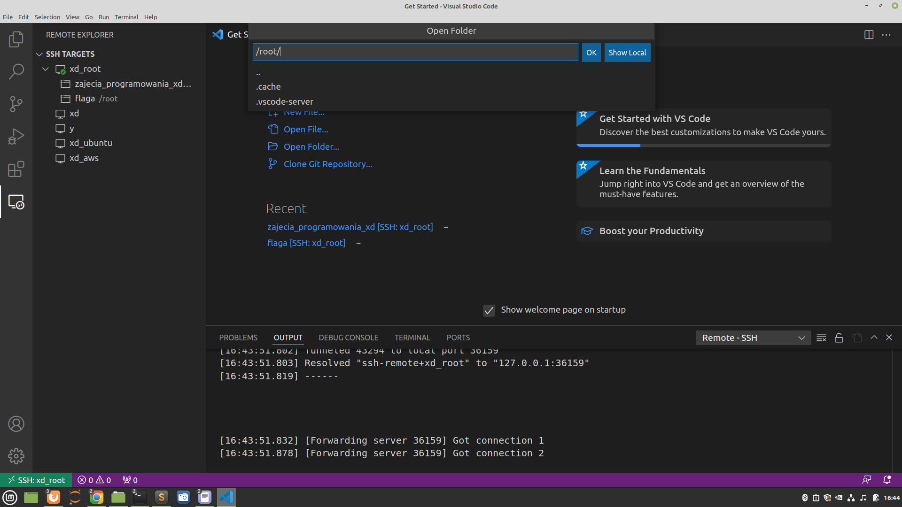
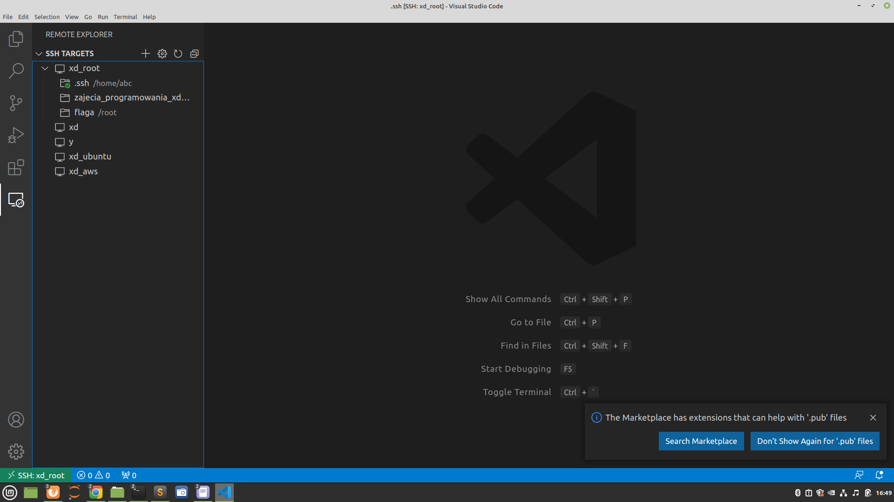
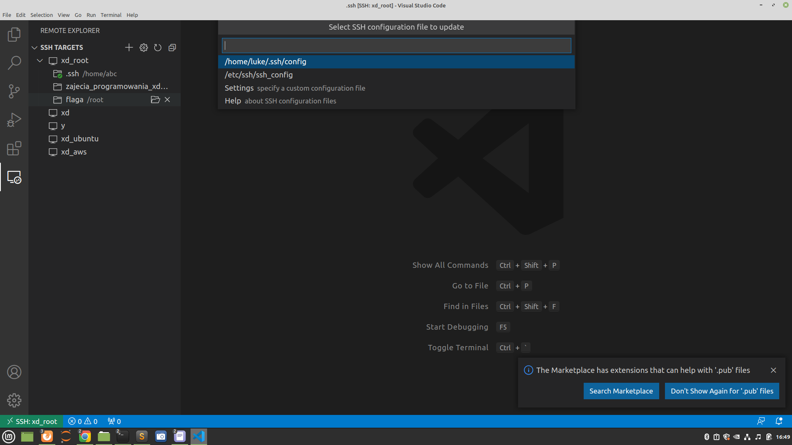
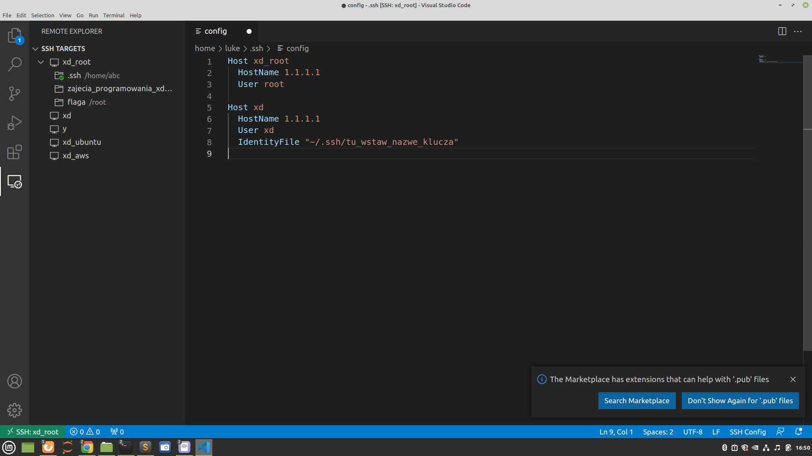

# Szturm na AWS

## Etap 7 - przygotuj serwer, postaw stronę www i powieś Flagę - wersja ASAP

**1. Przygotujesz serwer.** Zupdatujemy i poinstalujemy trochę programów, w tym:
- git'a
- nginx'a
- nano
- program do tworzenia środowisk programistycznych venv

**2. Pobierzesz kod z repozytorium [Flaga](https://github.com/ZPXD/flaga)**
- uzupełnimy plik z danymi o nazwę przygotowanej domeny
- automatycznie "poprozkładamy" pliki konfigurujące nginx i gunicorn we właściwych miejscach

**3. Uruchomisz "usługę" aplikacji strony www** 

tak aby była wystawiona w internecie i zobaczysz swoją stronę www sieci pod linkiem domeny. 

[Obejrzyj film jaks przygotować serwer, postawić stronę i powiesić flagę w wersji ASAP (w 5 minut)]()


#### PS: Jeżeli uznasz, że potrzebujesz bardziej wyczerpujących wyjaśnień i mocniejszych doświadczeń, wybierz:

[Etap 7 - droga Klasyczna - Instrukcje]( http://bityl.pl/BcfxJ)

I postaw cały serwer ręcznie, komenda po komendzie ucząc się po drodze Linuxa, a to na Linuxowych serwerach będą śmigały nasze skrypty, więc jest to absolutny fundament.

#### Do dzieła.

#### Cel:
- Postaw stronę www: niech będzie widoczna w internecie pod adresem Twojej domeny.
- Przygotuj serwer: załóż użytkownika i stwórz klucz RSA, pobierz go i zaloguj się nim ponownie.
- Modyfikuj zakładkę /xd swojej flagi.

#### Wsparcie:

[Pomoc na discordzie dla problemów związanych z Etapem 7](https://discord.gg/S5bN7TCAYq)


# Droga ASAP (Flaga w 5 minut):
 
 
**Słowem wstępu: Gdyby coś poszło nie tak, to można zrestartować serwer do ustawień początkowych:**
[Restart](http://bityl.pl/Bmvwu). Zaczynajmy:


Po zalogowaniu na serwer:

#### 1. wejdź na root (utwórz go jeżeli jeszcze nie robiłeś).
Powinieneś być już root. Robiliśmy to w [Etap 4 w kroku 6](https://github.com/ZPXD/flaga/blob/main/instrukcje/etap_4_3_zdobadz_serwer_polaczenie.md). Sprawdź to:
```
echo $USER
```
Jak pokazuje root to idź do kroku 2. Jeżeli nie, utwórz hasło dla root wpisując:
```
sudo su
```
I sprawdź znów pisząc "echo $USER", aż będzie pokazywać root. Jak masz błąd, wróć do etapu 4.3 lub spytaj na grupie o pomoc.

#### 2. Uruchom skrypt unite_the_clans.sh i wygraj przygodę za 1 komendą:

Poniższa komenda - wklej ją całą i puść enter :) po drodze spyta Cię o użytkownika i domenę. Domenę podaj jota w jotę bez spacji, bez dodatku 'http://' i bez 'www'. Użytkownika podaj bez spacji, dużych liter, znaków specjalnych. 
```
wget -q 'https://raw.githubusercontent.com/ZPXD/flaga/main/pomocnicze_skrypty/unite_the_clans.sh' && chmod +x unite_the_clans.sh && ./unite_the_clans.sh;
```

Zobacz w przeglądarce, Twoja strona już powinna być w internecie :)


#### 3. I gotowe :) teraz, aby logować się bez hasła krótką komendą, 

pobierz jeszcze klucz RSA, umieść go wypełniając poniższe:

#### 1. Otwórz VSCode i wejdź na swój serwer. 

Jeżeli masz z tym problem, wróć do [Etap 4.3 - połączenie z serwerem](https://github.com/ZPXD/flaga/blob/main/instrukcje/etap_4_3_zdobadz_serwer_polaczenie.md) i spokojnie powtórz sobie ten etap.




#### 2. Kliknij w "otwórz folder" i pokaże Ci się na górze belka z miejscem na adres folderu. Kliknij tam i skasuj go.



##### 3. Wpisz tam /home/X/.ssh <--- zamiast X - podaj nazwę swojego użytkownika, tę samą którą podawałeś na początku etapu 7.


#### 4. Kliknij ok. Pokaże Ci się folder .ssh z kluczami.

#### 5. Wybierz nowoutworzony klucz bez rozszeżenia .pub i pobierz go do siebie na komputer do swojego folderu .ssh.


#### 6. Opcjonalnie: czasem, jeżeli nie widzisz swojego folderu .ssh jak ja (a jest on zawsze w folderze domowym Twojego użytkownika na komputerze) - być może musisz kliknąć prawym przyciskiem myszy i odblokować tę opcję.


#### 7. Wejdź do folderu .ssh i tutaj zapisz plik z kluczem.

Ewentualnie zapisz go gdzie chcesz i skopiuj go do folderu .ssh potem tak jak uznasz.


#### 8. Włącz znów VSC. Kliknij w "SSH-Targets" w zembatkę (drugi przycisk po prawej od "SSH-TARGETS")




#### 9. Spyta Cię który plik edytować. Wybierz config z folderu .ssh (ten plik najwyżej na liście). I otwórz go.

Jeżeli jesteś w Home i wkleiłeś to o co prosiłem wcześniej, to zobaczysz coś w tym stylu (tylko inne adresy IP).



#### 10. Sprawdź swój terminal po odpaleniu skryptu,  postawieniu strony www i powieszeniu flagi.

Będzie tam fragment pliku Host do wklejenia. Będzie wyglądał podobnie do:

```
Host xd
  HostName 1.1.1.1
  User moja_nazwa_uzytkownika
  IdentityFile "~/.ssh/tu_wstaw_nazwe_klucza"
```

#### 11. Edytuj plik wstawiając swoje adresy IP, popraw nazwę klucza i zmień nazwę użytkownika w 2gim Hoście. Zapisz plik.




#### config dla AWS:

Wklej poniższe linie. Edytuj tam narazie tylko:
a) W linii 4 "IdentityFile "~/.ssh/tu_wstaw_nazwe_klucza.pem" edytuj nazwę klucza .pem
b) W linii 2 i 7 edytuj HostName - podaj prawidłowy adres IP Twojego serwera
c) Reszty narazie nie ruszaj.
d) Upewnij się, że Twój klucz .pem jest w folderze .ssh. Jeżeli nie, niech będzie tam :)


Gotowe! Pobaw się flagą, zmień coś (zobacz etap 8 w tym pliku) lub idź dalej. 


#### 12. Flaga.


**Cel:** dodaj coś do xDDD. Zmień coś. Zrób coś po swojemu.


- Edytuj plik tekstowy którego treść widać na Twojej stronie.
- Zobaczy czy na stronie jest nowa treść!
- Stwórz nową zakładkę wymaganą do przejścia szturmu!
- Zobacz czy zakładka działa :)


#### 1. Edytuj plik tekstowy którego treść widać na Twojej stronie.

Otwórz folder z kodem Flagi na serwerze w nowym oknie i otwórz Terminal.


Urządź się tu :) Będąc dalej na serwerze, w folderze /var/www/flaga edytuj zawartość pliku xd.txt. Dodaj tam coś od siebie.
```
cd /var/www/flaga
nano dane/xd.txt
```

#### 2. Zobaczy czy na stronie jest nowa treść!


Zobacz na stronie www czy działa :)


#### 3. Stwórz nową zakładkę wymaganą do przejścia szturmu!

Ostatnie co zostało, to edycja zakładki /xd flagi. Twoja flaga aby przejść dalej musi spełniać 3 kryteria. 
- być widoczna w sieci, czyli działać - to mamy
- w zakładce xd jest na niej "xD" - to też już mamy
- w zakladce xd jest na niej coś napisane poza "xDDD" - to mamy do zrobienia.

Wejdź w przeglądarce na adres swojej strony www i dopisz **/xd** - to Twoja zakładka /xd.

Bedąc dalej w folderze /var/www/flaga edytuj plik templates/xd.html. Zobacz, jest tam w 12 linii "xDDD". Zostaw xD (z dowolną ilością "D") i: dodaj coś od siebie. Dzięki temu będzie można sprawdzić czy ukończyłeś ten etap. Zrób to tak:
```
nano templates/xd.html
```
To plik html. Dodaj coś w 12 linii pomiędzy znakami ">" a "</h1>".
```
<h1 style="text-align:center">xDDD TUTAJ OD SIEBIE DOPISZ :) </h1>
```
Przeładuj:
```
sudo systemctl restart flaga.service
```
lub korzystając z gotowego skryptu:
```
sudo python3 pomocnicze_skrypty/reload.py
```

#### 4. Zobacz czy zakładka działa :)

Zobacz na stronie www czy działa :) - dodaj do swojego adresu "/xd" czyli jak masz domenę "kubus-puchatek.pl" to wpisz "kubus-puchatek.pl/xd".


#### Gotowe?

Możesz opuścić Terminal pisząć:

Najpierw aby się wylogować:
```
exit
```
Potem aby opuścić terminal:
```
exit
```
A strona nadal będzie stała w internecie.


**Przejdź dalej:**


[Etap 8 - Materiały i Jupyter - Instrukcje](http://bityl.pl/7efYd)
